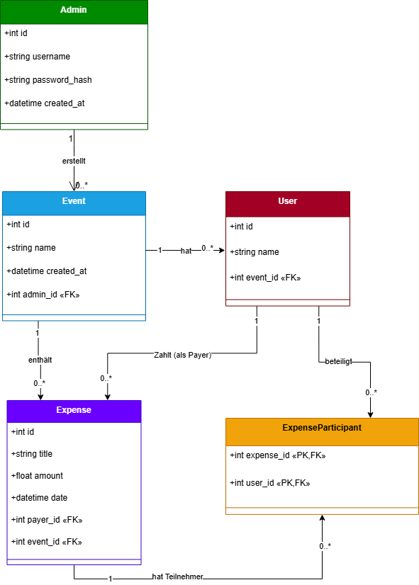

{: .label }
[Jane Dane]

{: .no_toc }
# Data model

{: .text-delta }

Table of contents

+ ToC
{: toc }

# Übersicht

Für QuickSplit haben wir ein einfaches aber effektives Datenmodell entwickelt. Wir brauchten eine Struktur, die Events, Benutzer und Ausgaben speichern kann und gleichzeitig die Beziehungen zwischen ihnen abbildet.

# ER-Diagramm

**Admin**

Die Admin-Tabelle speichert Informationen über Benutzer, die sich anmelden und Events erstellen können:

-id: Eindeutige ID (Primärschlüssel)

-username: Benutzername für den Login

-password_hash: Gehashtes Passwort für die Sicherheit

-created_at: Zeitpunkt der Erstellung des Admin-Accounts

Ein Admin kann mehrere Events erstellen.

**Event**

Events sind die Hauptorganisationseinheiten in unserer App:

-id: Eindeutige ID (Primärschlüssel)

-name: Name des Events (z.B. "Urlaub in Italien")

-created_at: Zeitpunkt der Erstellung

-admin_id: Fremdschlüssel zum Admin, der das Event erstellt hat

Ein Event kann mehrere Benutzer und Ausgaben haben.

**User**

User sind die Teilnehmer eines Events:

-id: Eindeutige ID (Primärschlüssel)

-name: Name des Benutzers

-event_id: Fremdschlüssel zum Event, zu dem der Benutzer gehört

Ein Benutzer gehört zu genau einem Event und kann mehrere Ausgaben bezahlen oder an Ausgaben beteiligt sein.

**Expense**

Expenses sind die Ausgaben innerhalb eines Events:

-id: Eindeutige ID (Primärschlüssel)

-title: Titel der Ausgabe (z.B. "Hotelrechnung")

-amount: Betrag in Euro

-date: Datum der Ausgabe

-payer_id: Fremdschlüssel zum Benutzer, der bezahlt hat

-event_id: Fremdschlüssel zum Event, zu dem die Ausgabe gehört

Eine Ausgabe gehört zu genau einem Event, hat genau einen Zahler und kann mehrere beteiligte Personen haben.

**ExpenseParticipant**

Diese Tabelle ist eine Verknüpfungstabelle, die die Viele-zu-viele-Beziehung zwischen Ausgaben und beteiligten Benutzern abbildet:

-expense_id: Teil des zusammengesetzten Primärschlüssels, Fremdschlüssel zur Ausgabe

-user_id: Teil des zusammengesetzten Primärschlüssels, Fremdschlüssel zum Benutzer

 

